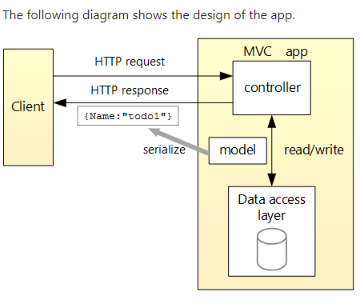

# APIs

## APIs 
- These are an interface that allows us to communicate with other applications by handling requests to send/recieve data and performing operations on such data

## RESTful APIs

- Basic Idea:
    - Client sends requests to the server as data. 
    - Server uses the client input to perform operations and return output data to the client

- REST stands for Representational State Transfer.
- REST defines a set of functions like GET, PUT, DELETE
- The main feature of a REST API is statelessness, meaning that servers do not save clients data between requests.

## API Endpoints

- Endpoints are the destinations to which the data arrives at. These are important since this is where the system is most vulnurable. 
    - Example of an endpoint:
        - URLs where the API is sending the data to

- To avoid security breaches, you can implement authentication tokens to prevent unauthorized access to the data

## More About APIs
https://aws.amazon.com/what-is/api/

# ASP.NET Core APIs Breakdown

## Controller Based APIs

- Consists of controller classes that derive from the ControllerBase class

    ```c#
    public class WeatherForecastController : ControllerBase
    ```

- ControllerBase provides a number of methods and properties that are useful for handling HTTP requests

- ASP.NET Core MVC provides attributes that can be used to configure the behavior of web API and action methods. 

    ```c#
    //MVC provided attributes
    [HttpPost]
    [ProducesResponseType(StatusCodes.Status201Created)]
    [ProducesResponseType(StatusCodes.Status400BadRequest)]
    public ActionResult<Pet> Create(Pet pet)
    {
        pet.Id = _petsInMemoryStore.Any() ? 
                _petsInMemoryStore.Max(p => p.Id) + 1 : 1;
        _petsInMemoryStore.Add(pet);

        //CreatedAtAction is an example of ControllerBase methods
        return CreatedAtAction(nameof(GetById), new { id = pet.Id }, pet);
    }
    ```

## Apply Attributes in multiple controllers

- EX.
    ```c#
    //parent class
    [ApiController]
    public class MyControllerBase : ControllerBase {}

    //child derived class
    [Produces(MediaTypeNames.Application.Json)]
    [Route("[controller]")]
    public class PetsController : MyControllerBase {}
    ```

## Attribute routing 
- Specifies URL pattern for a controller or action
    ```c#
    [Route("[controller]")]
    ```


## More About .NET APIs
https://learn.microsoft.com/en-us/aspnet/core/web-api/?view=aspnetcore-7.0

# ASP.NET Core APIs Tutorial

## Controller



- This is a controller which will manage the requests made to our API. When an application makes a request to our API by calling GetWeather, the "GET" method will run and execute the instructions, and return the data to the requestor.

    ```c#
    using Microsoft.AspNetCore.Mvc;

    namespace backend.Controllers
    {
        [ApiController]
        public class WeatherForecastController : ControllerBase
        {
            private static readonly string[] Summaries = new[]
            {
            "Freezing", "Bracing", "Chilly", "Cool", "Mild", "Warm", "Balmy", "Hot", "Sweltering", "Scorching"
        };

            private readonly ILogger<WeatherForecastController> _logger;

            public WeatherForecastController(ILogger<WeatherForecastController> logger)
            {
                _logger = logger;
            }

            [HttpGet("GetWeather")]
            public IEnumerable<WeatherForecast> Get()
            {
                return Enumerable.Range(1, 5).Select(index => new WeatherForecast
                {
                    Date = DateTime.Now.AddDays(index),
                    TemperatureC = Random.Shared.Next(-20, 55),
                    Summary = Summaries[Random.Shared.Next(Summaries.Length)]
                })
                .ToArray();
            }
        }
    }
    ```

# Data Model

- Data models are classes which defines an object that is used to bind the data received from anothe application, and through this data we can perform operations on the data.

    ```c#
        namespace backend
        {
            public class WeatherForecast
            {
                public DateTime Date { get; set; }

                public int TemperatureC { get; set; }

                public int TemperatureF => 32 + (int)(TemperatureC / 0.5556);

                public string? Summary { get; set; }
            }
        }
    ```

# Database Context

- Database Context is the main class that coordinates with Entity Framework functionality for a data model. 

- Entity Framework is an open-source framework for .NET apps, which allows us to make use of data in an object oriented approach. When we register our database context with our database, we are able to communicate with our database through objects by using LINQ(Language Integrated Queries) instead of traditional string queries.

    - Example of a DBContext class
    ```c#
    using Microsoft.EntityFrameworkCore;
    using System.Diagnostics.CodeAnalysis;

    namespace TodoApi.Models
    {
        public class TodoContext : DbContext
        {
            public TodoContext(DbContextOptions<TodoContext> options)
                : base(options)
            {
            }

            public DbSet<TodoItem> TodoItems { get; set; } = null!;
        }
    }
    ```

    - Example of how to register a database context
    ```c#
     services.AddDbContext<DBContextClass>(options => options.UseSqlServer(Configuration.GetConnectionString("Connection String")));
     ```

## More in-depth tutorial
https://learn.microsoft.com/en-us/aspnet/core/tutorials/first-web-api?view=aspnetcore-7.0&tabs=visual-studio